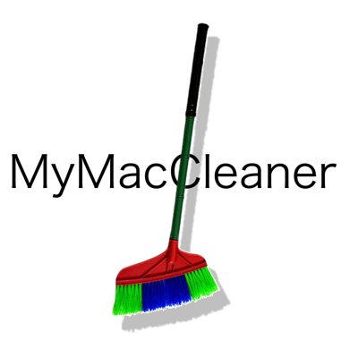

<h1 align="center">MyMacCleaner</h1>
<p align="center">
  
</p>
<p align="center"><b>A calm, honest Mac cleaner — scan, understand, then clean. Nothing is removed you didn't approve.</b></p>

<p align="center">
  
  
  
  
  <a href="LICENSE"></a>
</p>

<p align="center">
  <a href="#-what-is-mymaccleaner">What is it</a> &nbsp;&middot;&nbsp;
  <a href="#-the-four-step-flow">The flow</a> &nbsp;&middot;&nbsp;
  <a href="#-what-it-scans">What it scans</a> &nbsp;&middot;&nbsp;
  <a href="#-the-safety-model">Safety model</a> &nbsp;&middot;&nbsp;
  <a href="#-features">Features</a> &nbsp;&middot;&nbsp;
  <a href="#-architecture">Architecture</a> &nbsp;&middot;&nbsp;
  <a href="#-building--running">Building</a> &nbsp;&middot;&nbsp;
  <a href="#-testing">Testing</a> &nbsp;&middot;&nbsp;
  <a href="#-limitations">Limitations</a> &nbsp;&middot;&nbsp;
  <a href="#-roadmap">Roadmap</a>
</p>

---

## 💡 What is MyMacCleaner?

Most "one-click" Mac cleaners either delete too aggressively (breaking things) or hide so much behind a
paywall that the free version barely scans anything. **MyMacCleaner** is a small, native SwiftUI app built
around one rule: **it is more important not to delete the wrong file than to delete more files.**

Every candidate the scanner finds is labeled **SAFE**, **REVIEW**, or **PROTECTED**, with a plain-language
reason ("Why can I remove this?") attached to it. Nothing is ever deleted without the user reviewing the
list first, and the default action is always **Move to Trash** — never a silent, permanent delete.

| | |
|---|---|
| ✅ **It does** | Scan real caches, logs, temp files, Xcode build data, browser caches, and leftover installers on the current Mac; classify each one; let the user review and select; move approved items to the Trash. |
| 🚫 **It doesn't** | Touch `/System`, `/bin`, `/usr`, or any root-owned system location; touch personal documents, photos, or media; modify anything *inside* an app bundle; require `sudo` or install a background daemon; delete anything permanently without the user going through Finder's own Trash. |

## 🔄 The Four-Step Flow

```
Scan → Analyze → Review → Clean
```

1. **Scan** — one button, no setup. The scanner walks the known cache/log/build-data locations in the
   background (never on the main thread) and streams results back live.
2. **Analyze** — every file or folder is run through the Safety Engine and classified.
3. **Review** — results are grouped by category (and, for Developer Data, by sub-type — build data,
   archives, simulators, device support, package manager caches) so you can drill into exactly what's
   taking up space before deciding. The headline splits **Safe to Clean** from **Needs Review**, rather than
   quoting one combined number that hides how confident the app actually is about each part of it.
4. **Clean** — selected items move to the Trash. A confirmation screen states the total size and item count
   before anything happens.

## 🗂 What It Scans

| Category | Where | Default safety |
|---|---|---|
| Application Cache | `~/Library/Caches/*` (third-party apps), plus sandboxed apps' caches under `~/Library/Containers/*/Data/Library/Caches` and `~/Library/Group Containers/*/Library/Caches`, plus Electron/Chromium-style cache folders (`Cache`, `GPUCache`, `Code Cache`, ...) found inside `~/Library/Application Support/<App>` regardless of which app | SAFE |
| Browser Cache | Safari, Chrome, Firefox, Edge, Brave, Arc, Opera cache folders | SAFE |
| System Cache | `~/Library/Caches/com.apple.*` (per-user Apple caches: iCloud sync, Spotlight, QuickLook, ...) | SAFE |
| Logs | `~/Library/Logs`, old crash reports in `~/Library/Application Support/CrashReporter` | SAFE |
| Temporary Files | The user's `$TMPDIR` | SAFE |
| Developer Data | Xcode DerivedData, Archives, Simulator caches, iOS/watchOS Device Support, and package manager / tool caches (`~/.npm`, `~/.cache` — only whichever of these actually exist) | SAFE / REVIEW |
| Installer Files | Leftover `.dmg` / `.pkg` in `~/Downloads` | REVIEW |
| Trash | `~/.Trash` | SAFE (already discarded by the user) |

Xcode build data, Device Support, and browser/app caches regenerate automatically and cheaply, so they're
SAFE. Package manager and dev-tool caches (`~/.npm`, `~/.cache`) are REVIEW instead, even though they're
just as "regenerable" in principle — on a machine with a lot of ML/data tooling this bucket can reach tens
of GB of downloaded models, and re-fetching that is a meaningfully bigger ask than rebuilding a local Xcode
cache, so the user reviews what's actually inside before removing it rather than it being auto-selected.

Two features scan more broadly, but never auto-delete anything:

- **Large Files** — finds individual files and app-like bundles above a size threshold (1/5/10 GB) anywhere
  in the home folder, for manual review and Finder reveal only.
- **Duplicates** — finds files that are byte-for-byte identical (size → partial hash → full SHA‑256, never
  filename alone) in Downloads and Desktop, and lets you pick which single copy to keep.

**Deliberately not implemented:** system-wide caches/logs under root-owned paths (`/Library/Caches`,
`/var/log`), "removable space" (unused architecture slices / localizations *inside* app bundles), and
CoreSimulator's actual device data (`~/Library/Developer/CoreSimulator/Devices` — real simulator state, not
a cache). All three would require `sudo`, modifying a signed app bundle, or risk deleting a simulator still
in use — out of scope for what a cleaner app should touch without a very explicit, separate opt-in.

A Debug-only **Scan Diagnostics** panel (Settings, debug builds only) re-measures a curated list of
disk-heavy locations after a scan and reports how much of each was actually accounted for, to make it easy
to spot the scanner's next blind spot during development.

## 🛡 The Safety Model

```
                 ┌─────────────────────────────┐
                 │  Is it under a protected     │
                 │  path? (system, personal     │
                 │  docs, keys, running apps)   │──Yes──▶  PROTECTED
                 └──────────────┬───────────────┘
                                │ No
                                ▼
                 ┌─────────────────────────────┐
                 │  Category-specific rule      │
                 │  (cache → SAFE, archive      │
                 │  → REVIEW, ...)              │
                 └─────────────────────────────┘
```

Protected, unconditionally, regardless of size or age:

`/System`, `/bin`, `/sbin`, `/usr`, `/var/db`, `/private/etc` · Documents, Desktop, Pictures, Movies, Music ·
`.ssh`, `.git`, `.gnupg` directories anywhere in the path · Keychains and certificate files ·
the bundle of any currently-running application.

A file is **never** classified as safe to delete because it's old or because it's large — both heuristics
are explicitly rejected in the Safety Engine's design.

## ✨ Features

- **Overview** — disk usage, last scan time, and how much can be cleaned, one tap from a Scan button.
- **Clean** — category → subcategory → item drill-down, per-item "why can I remove this?", live scan
  progress with a cancel button, a permission banner (with a direct link to System Settings) when a location
  needs access the user hasn't granted yet.
- **Large Files** — 1/5/10 GB filter, Finder reveal, no auto-delete.
- **Applications** — installed app list with size/version, leftover cache/preferences detection by bundle
  identifier, uninstall blocked while the app is running.
- **Duplicates** — content-verified duplicate groups with a "keep this copy" picker.
- **Settings** — language switch (English / 한국어 / follow system, applied instantly, no relaunch) and a
  Full Disk Access shortcut.

## 🏗 Architecture

```
MyMacCleaner/
├── App/            Entry point, root navigation, localization, shared formatting/views
├── Features/       One folder per screen (Overview, Clean, LargeFiles, Applications, Duplicates, Settings)
├── Core/
│   ├── ScannerEngine/     Walks disk locations, streams classified results, cancellable, bounded concurrency
│   ├── SafetyEngine/      SAFE / REVIEW / PROTECTED classification + the protected-path registry
│   ├── FileClassifier/    Maps well-known folders to a scan category (and Developer Data to a subcategory)
│   ├── DuplicateEngine/   Size → partial hash → full hash duplicate detection
│   └── PermissionManager/ Turns filesystem errors into user-facing skip reasons — never a crash
└── Services/       Cross-feature I/O: disk usage, installed apps, diagnostics, the actual move-to-trash step
MyMacCleanerTests/  Swift Testing suites against real temporary files and directories — no mocked filesystem
```

No third-party dependencies: Swift, SwiftUI, AppKit, Foundation, CryptoKit (for duplicate hashing), and
`ServiceManagement` only.

## 🚀 Building & Running

Requirements: Xcode 16+, macOS 14+ deployment target, [XcodeGen](https://github.com/yonaskolb/XcodeGen).

```bash
git clone https://github.com/amuldi/MyMacCleaner.git
cd MyMacCleaner

xcodegen generate   # regenerates MyMacCleaner.xcodeproj from project.yml

xcodebuild -project MyMacCleaner.xcodeproj -scheme MyMacCleaner build
xcodebuild -project MyMacCleaner.xcodeproj -scheme MyMacCleaner test
```

Or open `MyMacCleaner.xcodeproj` in Xcode and run the `MyMacCleaner` scheme directly. The `.xcodeproj` is
generated, not hand-edited — change `project.yml` and re-run `xcodegen generate` instead of editing project
settings in Xcode.

## ✅ Testing

Swift Testing suites cover the Scanner, Safety, Duplicate, and Cleanup engines plus the Clean screen's state
machine (scan / cancel / review / clean / empty result / error) — all against real temporary files and
directories created and torn down per test, including real permission-denied and locked-file cases. No
filesystem mocking.

```bash
xcodebuild -project MyMacCleaner.xcodeproj -scheme MyMacCleaner test
```

## ⚠️ Limitations

- No custom uninstall helper for system-level leftovers that require elevated privileges — by design.
- Duplicates currently scans a fixed folder set (Downloads, Desktop); no folder picker yet.
- Application "leftover" detection is heuristic (bundle identifier + display name matching); anything
  ambiguous is left as REVIEW rather than guessed at.
- Application Support cache detection matches by well-known Chromium/Electron folder *names* (`Cache`,
  `GPUCache`, ...), not by app identity — an app whose cache doesn't use one of those names (or a genuinely
  safe-to-remove folder with an unrecognized name, like a one-time installer's leftover scratch directory)
  stays undetected rather than guessed at.
- `CoreSimulator/Devices` (real simulator instances, not their cache) is intentionally never scanned; freeing
  it means deleting unavailable simulators via Xcode itself.
- No dedicated UI automation (XCUITest) suite yet — UI-level behavior is covered at the view-model/state
  level instead.

## 🗺 Roadmap

**Shipped:**

- ✓ Scan → Analyze → Review → Clean, with cancellable, non-blocking background scanning
- ✓ Category + subcategory drill-down (Developer Data → build data / archives / simulators / device
  support / package manager caches)
- ✓ Sandboxed-app and Electron-app cache detection (Containers, Group Containers, Application Support)
- ✓ Large Files, Applications (with leftover + uninstall), Duplicates (content-verified)
- ✓ English / Korean localization, switchable at runtime from Settings
- ✓ Custom app icon
- ✓ Debug-only Scan Diagnostics panel (coverage gap detection)

**Planned:**

- A folder picker for Duplicates
- An XCUITest suite for full click-through UI regression coverage

## 🤝 Contributing

Issues and pull requests are welcome. Keep changes scoped, keep the safety rules intact (nothing in
`ProtectedPathRegistry` gets loosened without a very good reason in the PR description), and run the test
suite before opening a PR.

## 📄 License

[MIT](LICENSE).
